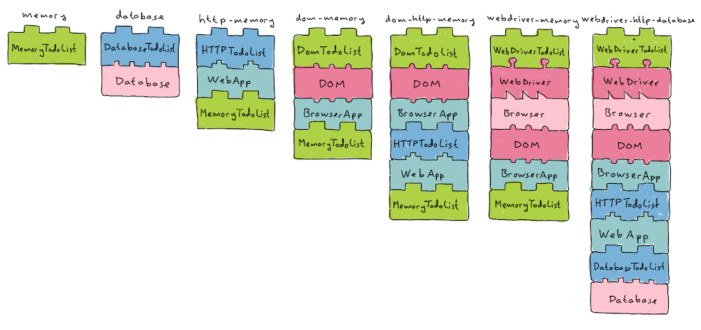

# Assembly Runner

La intención de este paquete es proveer un mecanismo extensible que facilite la construcción y uso de distintos assemblies en pruebas automatizadas.

## ¿Que es un Assembly?

La idea de Assembly está tomada de la arquitectura hexagonal (o Ports and Adapters).



_Fuente: [Subsecond TDD](https://github.com/subsecondtdd/todo-subsecond)_

En la imagen, cada conjunto de bloques representa un assembly. Estos pueden configurarse para crear múltiples variantes que ejercitan el sistema a distintos niveles de profundidad.

## Uso

### Denifir el Lineup

Al conjunto de assemblies disponibles lo llamamos Lineup. El Lineup es un array de objetos que deben cumplir con el siguiente contrato:

1. Tener nombre
1. Lista de adaptadores. (Podría no tener ninguno. Sería el caso donde se prueba al sistema de punta a punta y no se adapta ninguna de sus partes).
1. Drivers. La lista de objetos que van a guiar o ejecutar la prueba. (Podría usar un web driver si voy a interactuar con la web o un http driver si voy a interactuar con http, para ejercitar un servicio rest por ejemplo)

Ejemplo:

```typescript
const lineup = [
  {
    name: "mock-api",
    adapters: [
      {
        name: "mock-api",
        constructor: (page: Page) => new MockApiAdapter(page),
      },
    ],
    drivers: [
      {
        name: "bienvenida",
        constructor: (_: APIRequestContext, page: Page) => new BienvenidaPlaywrightDriver(page),
      },
      {
        name: "grupos",
        constructor: (_: APIRequestContext, page: Page) => new GruposPlaywrightDriver(page),
      },
    ],
  },
  {
    name: "e2e",
    adapters: [],
    drivers: [
      {
        name: "bienvenida",
        constructor: (_: APIRequestContext, page: Page) => new BienvenidaPlaywrightDriver(page),
      },
      {
        name: "grupos",
        constructor: (_: APIRequestContext, page: Page) => new GruposPlaywrightDriver(page),
      },
    ],
  },
] as const satisfies Lineup;
```

### Crear el assembly

Al ejecutar los tests, es necesario utilizar un assembly específico. Este paquete tiene como objetivo simplificar la configuración de un assembly, permitiendo que un test se ejecute en cualquiera de los assemblies definidos en el Lineup.

Ejemplo:

```typescript
const assembly = lineup.find((a) => a.name === "e2e");

let testAssembly = TestAssemblyFactory(assembly, {
  adaptersConstructorArgs: [page],
  driversConstructorArgs: [request, page],
});
```

Los tipos de adapters y drivers disponibles para utilizar en el factory **TestAssemblyFactory** están dados por el Lineup. Los objetos **page** y **request** son de tipo **Page** y **ApiRequestContext** respectivamente y fueron definidos en la declaración del Lineup en el ejemplo anterior.

## Ejecución de Tests

Para ejecutar los tests, simplemente usa el siguiente comando:

```bash
npm test

## Caso de uso: Repartir

Repartir es una web app diseñada para ser un catálogo de tipos de pruebas. Por eso su estructura de carpetas no sigue ningún estándar de alguna tecnología en particular. Allí se puede encontrar un ejemplo de uso funcional del Assembly Runner.

Ver este documento: [Arquitectura de pruebas](../../../../../docs/arquitectura-de-pruebas.md)
